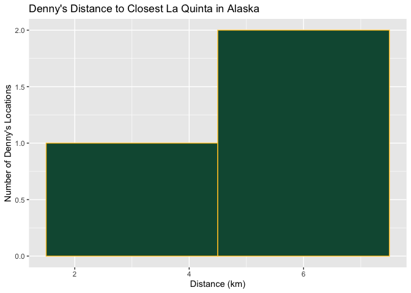

Lab 04 - La Quinta is Spanish for next to Denny’s, Pt. 2
================
Conor Lacey
02-07-23

### Load packages and data

``` r
suppressWarnings(library(tidyverse))
library(dsbox) 
library(ggplot2)
library(psych)
```

``` r
states <- read_csv("data/states.csv")
dn <- dennys
lq <- laquinta
```

### Exercise 1

``` r
dn_ak <- dn %>%
  filter(state == "AK")
nrow(dn_ak)
```

    ## [1] 3

Wow. There are only 3 Denny’s locations in Alasksa.

### Exercise 2

``` r
lq_ak <- lq %>%
  filter(state == "AK")
nrow(lq_ak)
```

    ## [1] 2

Alaska is not very popular. There are only 2 La Quintas in Alaska.

### Exercise 3

Now we need to join all Denny’s locations with all La Quinta locations
in Alaska. From the looks of things we will need to calculate 6
distances.

``` r
dn_lq_ak <- full_join(dn_ak, lq_ak, by = "state")
dn_lq_ak
```

    ## # A tibble: 6 × 11
    ##   address.x      city.x state zip.x longi…¹ latit…² addre…³ city.y zip.y longi…⁴
    ##   <chr>          <chr>  <chr> <chr>   <dbl>   <dbl> <chr>   <chr>  <chr>   <dbl>
    ## 1 2900 Denali    Ancho… AK    99503   -150.    61.2 3501 M… "\nAn… 99503   -150.
    ## 2 2900 Denali    Ancho… AK    99503   -150.    61.2 4920 D… "\nFa… 99709   -148.
    ## 3 3850 Debarr R… Ancho… AK    99508   -150.    61.2 3501 M… "\nAn… 99503   -150.
    ## 4 3850 Debarr R… Ancho… AK    99508   -150.    61.2 4920 D… "\nFa… 99709   -148.
    ## 5 1929 Airport … Fairb… AK    99701   -148.    64.8 3501 M… "\nAn… 99503   -150.
    ## 6 1929 Airport … Fairb… AK    99701   -148.    64.8 4920 D… "\nFa… 99709   -148.
    ## # … with 1 more variable: latitude.y <dbl>, and abbreviated variable names
    ## #   ¹​longitude.x, ²​latitude.x, ³​address.y, ⁴​longitude.y

### Exercise 4

There are 6 observations in the dn_lq_ak data set. The names of the
variables are as follows:

``` r
colnames(dn_lq_ak)
```

    ##  [1] "address.x"   "city.x"      "state"       "zip.x"       "longitude.x"
    ##  [6] "latitude.x"  "address.y"   "city.y"      "zip.y"       "longitude.y"
    ## [11] "latitude.y"

### Exercise 5

We can use the mutate function to add a new variable to a data frame
while keeping the existing variables.

### Exercise 6

``` r
source("haversine.R")
dn_lq_ak <- dn_lq_ak %>% mutate(distance = haversine(dn_lq_ak$longitude.x,dn_lq_ak$latitude.x,
                                                      dn_lq_ak$longitude.y,dn_lq_ak$latitude.y))
dn_lq_ak["distance"]
```

    ## # A tibble: 6 × 1
    ##   distance
    ##      <dbl>
    ## 1     2.04
    ## 2   416.  
    ## 3     6.00
    ## 4   414.  
    ## 5   420.  
    ## 6     5.20

### Exercise 7

``` r
dn_lq_ak_mindist <- dn_lq_ak %>%
  group_by(address.x) %>%
  summarize(closest = min(distance))

dn_lq_ak_mindist
```

    ## # A tibble: 3 × 2
    ##   address.x        closest
    ##   <chr>              <dbl>
    ## 1 1929 Airport Way    5.20
    ## 2 2900 Denali         2.04
    ## 3 3850 Debarr Road    6.00

### Exercise 8

``` r
dn_lq_ak_mindist %>% ggplot(aes(x = closest)) +
  geom_histogram(fill = "#115740", color = "#ffc72c", binwidth = 3) +
  labs(title = "Denny's Distance to Closest La Quinta in Alaska Distribution",
       x = "Distance (km)",
       y = "Number of Denny's Locations")
```

<!-- -->

``` r
describe(dn_lq_ak_mindist$closest)
```

    ##    vars n mean  sd median trimmed  mad  min max range  skew kurtosis   se
    ## X1    1 3 4.41 2.1    5.2    4.41 1.19 2.04   6  3.96 -0.32    -2.33 1.21

There is a mean distance of 4.41km from Denny’s to the closest La Quinta
location and a variance of 4.41km. However, with just three data points
this is not a lot of information to go off of.

### Exercise 10

``` r
#Create Texas data
lq_tx <- lq %>%
  filter(state == "TX")

dn_tx <- dn %>%
  filter(state == "TX")

#join datasets
dn_lq_tx <- full_join(dn_tx, lq_tx, by = "state")

#add distance variable
dn_lq_tx <- dn_lq_tx %>% mutate(distance = haversine(dn_lq_tx$longitude.x,dn_lq_tx$latitude.x,
                                                      dn_lq_tx$longitude.y,dn_lq_tx$latitude.y))
#minimum distance
dn_lq_tx_mindist <- dn_lq_tx %>%
  group_by(address.x) %>%
  summarize(closest = min(distance))

#plots
dn_lq_tx_mindist %>% ggplot(aes(x = closest)) +
  geom_histogram(fill = "#BF5700", color = "#333F48", binwidth = 1) +
  labs(title = "Denny's Distance to Closest La Quinta in Texas Distribution",
       x = "Distance (km)",
       y = "Number of Denny's Locations")
```

<!-- -->

``` r
#describe data
describe(dn_lq_tx_mindist$closest)
```

    ##    vars   n mean   sd median trimmed  mad  min   max range skew kurtosis   se
    ## X1    1 200 5.79 8.83   3.37    3.88 4.06 0.02 60.58 60.57 3.37    13.53 0.62

For Texas, there is a mean distance of 5.79km from Denny’s to the
closest La Quinta location and a variance of 78km. There is a large
positive skew in this dataset.
